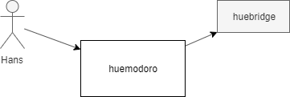
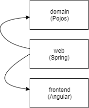
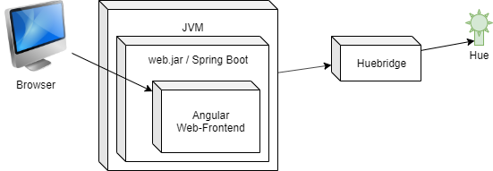

**About arc42**

arc42, the Template for documentation of software and system
architecture.

By Dr. Gernot Starke, Dr. Peter Hruschka and contributors.

Template Revision: 7.0 EN (based on asciidoc), January 2017

© We acknowledge that this document uses material from the arc 42
architecture template, <http://www.arc42.de>. Created by Dr. Peter
Hruschka & Dr. Gernot Starke.

Introduction and Goals {#section-introduction-and-goals}
======================

Huemodoro is a pomodoro timer with a twist:

The current session state is signalled via a colorful frontend and a connected hue IoT lightbulb.
Sessions can be started, paused and resetted. 

Stakeholders {#_stakeholders}
------------

| Role/Name   |
|-------------| 
| Product Owner | 
| CEO         |

System Scope and Context {#section-system-scope-and-context}
========================

Business Context {#_business_context}
----------------

Hans uses huemodoro via a web-frontend. 
The lightbulb is connected via huebridge -- an external component.

Building Block View {#section-building-block-view}
===================

Whitebox Overall System {#_whitebox_overall_system}
-----------------------

### Motivation

Overall arch follows a ports and adapters pattern.
This way the domain can be developed independently from the infrastructure parts.

### Contained Building Blocks

*Domain* contains business logic.

*Web* encapsulates tech infrastructure for backend.

*Frontend* provides a browser ui.

For architectural details on Angular frontend:
`npm run compodoc`

<!-- List of classes in packages -->

### Important Interfaces

Frontend interacts with the backend session through the ` SessionRepository` interface.
It supports (running, stopping , resetting, reloading, advancing)

<!-- TODO other interfaces -->

Deployment View {#section-deployment-view}
===============

Huemodoro is deployed as a single jar file.
Huebridge must be reachable via configured ip-address.